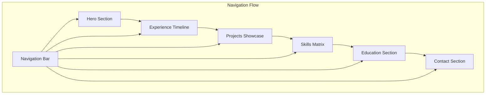

## 1. Product Overview
A high-impact portfolio website for Ayoub Mzari that combines professional WordPress/Full-Stack development expertise with an eye-catching Gen Z Racing aesthetic inspired by Lando Norris's website. The portfolio showcases technical skills, professional experience, and innovative projects through an immersive, dark-themed design with neon accents that immediately captures recruiter attention.

Target audience: Tech recruiters, hiring managers, and potential clients seeking skilled WordPress/Full-Stack developers. The website positions Ayoub as a forward-thinking developer who understands both technical excellence and modern design trends.

## 2. Core Features

### 2.1 User Roles
| Role | Registration Method | Core Permissions |
|------|---------------------|------------------|
| Visitor | No registration required | Browse all portfolio content, view projects, download resume |
| Admin | Secure login (hidden) | Update content, manage projects, modify experience/education |

### 2.2 Feature Module
The portfolio consists of the following main pages:
1. **Hero Section**: Dynamic animated introduction with name, title, and call-to-action buttons
2. **Experience Timeline**: Professional journey showcasing SecureValley Training Center and Golden Park roles
3. **Projects Showcase**: Interactive project cards for Agenteo, LinkSphere, Risk Vision, and MyFeedPro
4. **Skills Matrix**: Technical competencies organized by categories with visual skill bars
5. **Education Section**: Academic background and certifications
6. **Contact Section**: Professional contact information and social links

### 2.3 Page Details
| Page Name | Module Name | Feature description |
|-----------|-------------|---------------------|
| Hero Section | Animated Intro | Display name with typewriter effect, rotating job titles (WordPress Developer/Full-Stack Developer), neon-accented call-to-action buttons for "View Projects" and "Download Resume" |
| Hero Section | Navigation | Fixed top navigation with smooth scroll to sections, mobile-responsive hamburger menu, active section highlighting |
| Experience Timeline | SecureValley Card | Show 2025-present role as WordPress/Full-Stack Developer with bullet points for internal tools, performance optimization, and server administration |
| Experience Timeline | Golden Park Card | Display 2023-2025 role highlighting 20+ e-commerce sites, AWS hosting, Amazon Polly integration, and DNS management |
| Projects Showcase | Agenteo Project | Feature AI Voice Assistant for reservations with 3-month duration, speech recognition capabilities, and telephony infrastructure |
| Projects Showcase | LinkSphere Project | Present automated PBN SEO service with 2-week development time, backlink generation, and domain management features |
| Projects Showcase | Risk Vision Project | Display AI-powered risk management platform from Bolt Hackathon, ReactJS + Supabase stack, real-time risk prediction |
| Projects Showcase | MyFeedPro Project | Showcase SaaS NFC card platform with user dashboards, admin panels, and centralized client management |
| Skills Matrix | Technical Skills | Organize cloud computing (AWS, VPS, DNS), web development (WordPress, React, Angular), mobile (Flutter, Android), databases (Oracle SQL), and other competencies with proficiency indicators |
| Education Section | Academic Timeline | Display EST Kénitra (2022-2023), 3W Academy (2021), and ISTA NTIC (2020-2022) with degree descriptions and certifications |
| Contact Section | Professional Contact | Show phone (+212682282716), email (ayoub.mzari@uit.ac.ma), location (Wifak, Temara) with copy-to-clipboard functionality and social media links |

## 3. Core Process
**Visitor Flow:**
1. Land on Hero section with animated name/title introduction
2. Scroll through experience timeline showcasing professional journey
3. Explore interactive project cards with hover effects and detailed descriptions
4. Review technical skills matrix organized by competency areas
5. Check educational background and certifications
6. Access contact information and download resume

**Admin Flow:**
1. Secure login to content management interface
2. Update project details, add new projects, or modify existing content
3. Edit experience descriptions or add new roles
4. Manage skills list and proficiency levels
5. Update contact information and social links

## 4. User Interface Design

### 4.1 Design Style
- **Primary Color**: #050505 (Deep black background)
- **Secondary Color**: #CCFF00 (Neon Volt accent)
- **Accent Colors**: #FFFFFF (Pure white text), #1A1A1A (Card backgrounds)
- **Typography**: Wide Sans-Serif for headers (similar to F1/racing fonts), Monospace for technical details
- **Button Style**: Rounded corners with neon glow effects on hover, 3D depth illusion
- **Layout**: Bento Grid system with asymmetric card arrangements
- **Icons**: Minimalist line icons with neon accents, racing-inspired metaphors
- **Animations**: Smooth parallax scrolling, card hover effects, typewriter text animations

### 4.2 Page Design Overview
| Page Name | Module Name | UI Elements |
|-----------|-------------|-------------|
| Hero Section | Animated Intro | Full-screen dark background with subtle gradient overlay, oversized name typography (72px+), rotating job titles with neon volt underline, prominent CTA buttons with hover glow effects |
| Experience Timeline | Role Cards | Bento grid layout with alternating card sizes, hover-activated neon borders, company logos with grayscale-to-color transition, timeline connector with racing stripe design |
| Projects Showcase | Project Grid | Masonry-style grid with varying card heights, hover effects revealing tech stack badges, project duration badges in top-right corners, "View Details" buttons with arrow animations |
| Skills Matrix | Competency Grid | Circular progress indicators for skill levels, category headers with neon volt accents, skill tags with subtle background glow, responsive grid that adapts to screen size |
| Contact Section | Info Cards | Clean card-based layout with copy-to-clipboard icons, social media buttons with platform-specific colors, contact form with neon-focused input fields |

### 4.3 Responsiveness
- **Desktop-First**: Optimized for 1920x1080 and larger displays with full Bento Grid experience
- **Mobile-Adaptive**: Single-column layout for mobile devices with touch-friendly interactions
- **Tablet Optimization**: 2-column grid layout for medium screens with maintained visual hierarchy
- **Touch Interactions**: Swipe gestures for project carousel, tap-to-copy contact info, long-press skill details

### 4.4 Performance & Technical Excellence
- **Loading Strategy**: Lazy loading for project images, progressive enhancement for animations
- **SEO Optimization**: Semantic HTML structure, meta tags for recruiter searches, structured data for portfolio pieces
- **Accessibility**: High contrast ratios, keyboard navigation support, screen reader compatibility
- **Performance Budget**: Sub-3 second initial load, 60fps animations, optimized asset delivery